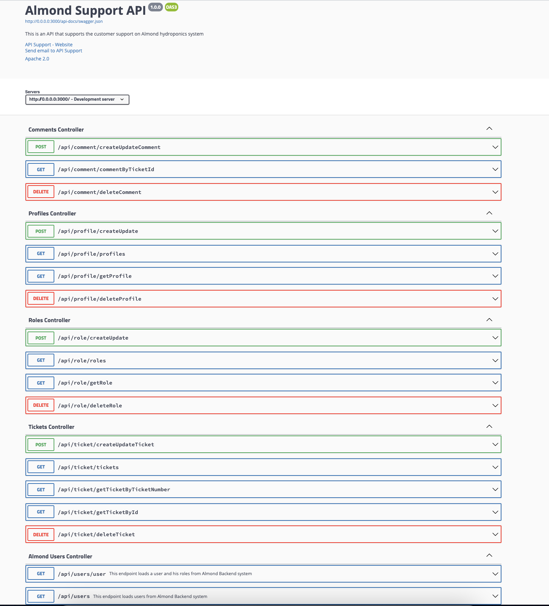

## Almond Support API

[](https://shields.io/)
[](https://codeclimate.com/github/almond-hydroponics/support-be/maintainability)
[](https://codeclimate.com/github/almond-hydroponics/support-be/test_coverage)

##### Support API to manage issues and tickets from almond clients

## setup

- clone repo

```
https://github.com/almond-hydroponics/support-be.git
```

- install dependencies

```
yarn install
```

- set up mongo client
  
- start application

```
yarn start
```


## Swagger Documentation

- Swagger JSON is available on http://0.0.0.0:3000/api-docs/swagger.json
- Swagger UI is available on http://0.0.0.0:3000/api-docs/

{This should be after setup and startup}




## Framework used

<p style="text-align: center" align="center">
 <a href="https://tsed.io" target="_blank"></a>
</p>
